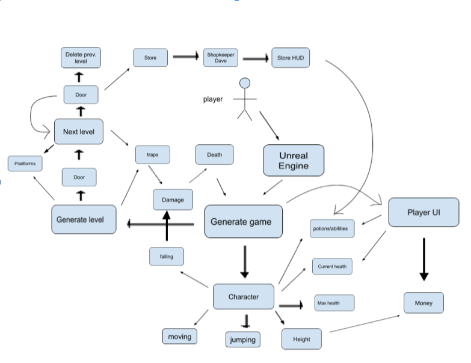
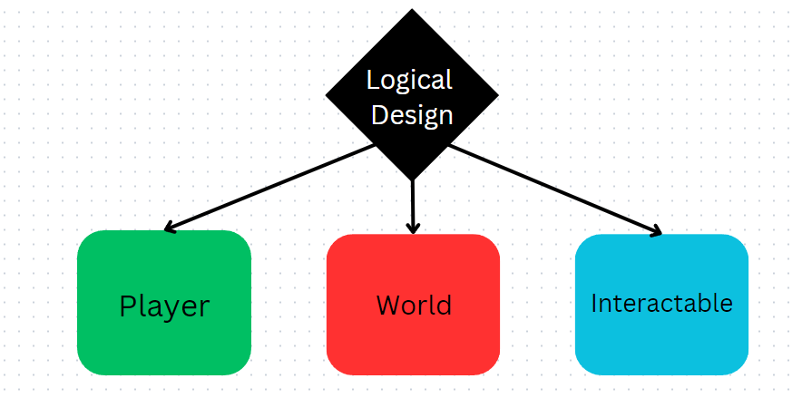
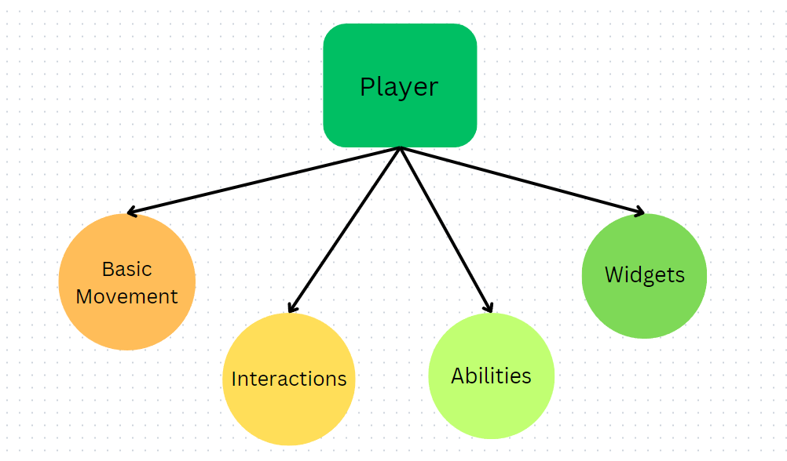
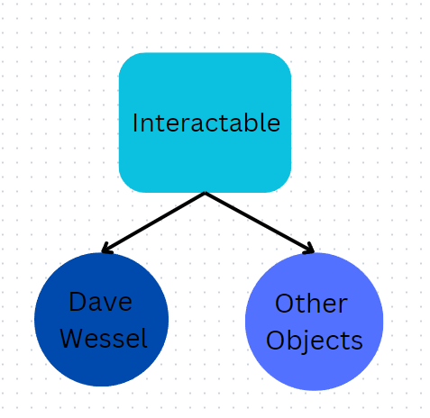

# Gravity Grippers - Project Jump
Contact: hengstler2005@gmail.com

# Design Overview

# Table of Contents
* Design Overview
* Logical Design
* * Player
* * * Basic Movement
* * * Jump
* * * Move 
* * * Abilities
* * * Interactions
* * Interactables
* * * David Wessel
* * World
* * * Tower Boundary
* * * Random Platform Spawner
* * * One Way Platform
* * * Level-traversing Door
* * * Shop
* * Physical Design
* * * Overview
* * * Structure of Directories
* * * C++ Classes

# Logical Design
Our Projects top layer of Systems consists of three different Systems of Player, Interactables, and World.

## Player:
Player is all systems inside of, and directly interacting with the player. This is broken down further into Basic Movement, Abilities, Widgets, and Interactions.

### Basic Movement:
Basic Movement is responsible for basic movement components of the player such as move, and jump. It works with the interact system, to make sure that the player can't do any basic movement while interacting.

Jump: Jump is a blueprint implemented function and charges while the player holds space, then launches in the air with a force determined by how long the player held the button. The jump mechanic interacts with the move to make sure the player cannot move while charging the jump, as well as the interactables to make sure the player can't jump while interacting. 

Move: This is blueprint implemented and moves the player left or right. It works with the interaction system to make sure the player can't move while in the shop or interacting, as well as the jump system to be able to move while in the air jumping.

### Abilities:
Abilities will interact with the player class, and the shop in interactables, and the widgets to display that the player has unlocked an ability. The shop will set bools for whether a player has an ability or not. When the bool is true, the player will be able to use the ability with a set keybind. What the abilities will be is undetermined but this is how they will interact.

### Widgets:
Widgets are how the UI works in Unreal. Widgets will be added to the player and when they are needed will be switched from/to visible/invisible. This will interact with Interactables to tell when to display what widgets, as well as the abilities to display widgets that let the user know they have unlocked an ability.

### Interactions:
Interactions handling in the player include two functions which are Interact and InteractCheck. 
Interact check is called every tick and checks if an object directly behind the player is castable to an Interactables class, if it is it updates the InteractHitResult on the line trace channel in unreal to the object.
Interact is called when the player clicks the interact button E, it calls the function OnInteract that is in the Interactables object and that object executes its function.

## Interactables: 
Interactables is a class of objects that each object we want the player to interact with inherits from. This class has one function which is OnInteract, since this function is inherited, every interactable has it and when it is called it calls the native function of whatever object to execute their function.
The Interactables heavily interact with the World to place these objects in the world and procedurally generate them, as well as the player who initiates calls for these objects. Widgets are also used for some of these objects. Currently the only interactable implemented so far is DaveWessel.

### DaveWessel: 
When Dave Wessel is interacted with, the players camera is changed to Dave's camera and the player can no longer move. It also pulls up the Widget for the shop. When the player presses the interact button again their camera switches back to the default for the player camera and it is able to move again. Dave works with the player using its widgets, and interact, as well as stopping it from moving.

## World:
World is the physical level that the player will be moving around inside during the game experience. Players will spawn into an initial level that will contain different objects: Tower Boundary, Random Platform Spawner, One Way Platform, Level Traversing Door, and Shop.

### Tower Boundary:
The tower boundary is a class that takes in max X and Y values and generates the borders of our tower by spawning in blocks repeatedly, starting one where the next one finishes, up to a defined Max value. This border prevents the player from walking through and creates the level of our game.

### Random Platform Spawner:
The random platform spawner is another blueprint class in our world folder that takes in the following variables to create a random level upon compile time: 
Max Blocks: The maximum amount of blocks that can spawn per floor
Chance of spawning: The chance of a block spawning in a specific position on each floor, can be altered to make the game easier or harder. Increasing this number too much will cause the platforms to spawn heavily on the right hand side as that is where the iteration starts.
This system randomly generates a new level with every compile and so the player will never play the exact same level twice, which increases the difficulty and strategy of our game.

### One Way Platform:
The one way platform class was implemented early on in our project as a basic floor/roof of each level. Once the player jumps and reaches the bottom of this platform, a function recognizes this overlap and allows the player sprite to pass through until it is clear above the platform. Once it does this and the overlap ends, the player cannot pass back through unless the keyboard input ‘s’ is pressed, which allows the player to fall back through. 

### Level Traversing Door:
The level traversing door will move players from one location to another. This will utilise the interact feature from the player interacting with the door, at which point the player will be “teleported” 

### Shop:
The shop will be a location the player can access in order to purchase power ups using currency collected during the game. This shop will be accessed via a interactable door at the base of each tower level. The door will be an interactable object that spawns the player into a specific location within the shop.

# Physical Design
We are implementing our project using unreal engine 5, which uses a collaboration between blueprints and C++. There are some features that are much easier to implement using blueprints and some that are much easier using C++ classes so we have decided that using a mixture of both provides the most efficient procedure to completing our game. Blueprints are an unreal specific visual style coding practice, where you can see the actual flow of the code and track how events are performed. These blueprint classes mimic C++ logic and the actions we wish to implement can be written both ways.
The directories for most of the file structure is inherent to our Unreal Engine 5 project. The directories created for our unreal project are:
* Config
* Content
* * ExternalActors
* * ExternalObjects
* * Adventurer-1.5
* * Blueprint
* * * Player
* * * World
* * EPMasterMaterials
* * PlayerSprites
* * StarterContent
* * Intermediate
* * Build
* * ShaderAutogen
* Saved
* Source
The important part of the directories of our concern are contained inside the Blueprints folder and the Source folder.
Blueprints folder contains all .uasset files which are Unreal Engine 5’s way of saving our blueprints we create inside the Unreal Engine 5 UI. These are important components to the functioning of our game.
In the Source folder we have our C++ implementations inside the Private folder, and our C++ header files inside the Public folder so the classes and Our public classes currently Include MyPlayerClass, Interactables, and DaveWessel.

## MyPlayerClass:
The player class has 3 public functions currently. SetCanMove, SetInteractWidgetVisibility, and Interact.

### SetCanMove: Input(bool)
This parameter is used to determine whether the player can move or not based on the input value.

### SetInteractWidgetVisibility: Input(bool)
This parameter changes whether the interact widget is visible or not based on the input value.

### Interact:
Interact is used to call the interact function of an object that is line traced behind the player. There is no input and no output, it simply calls the object's function.
##Interactables
There is only one public function for interactables which is InteractReceived.

### InteractReceived:
This function does not do anything but log to the console that its called. This is simply so that there is a common function within every interactable object for the player to call when they want to interact.

## DaveWessel:
Public methods for Dave are only InteractReceived. 

### InteractReceived: 
This is the inherited function from the Interactables class, when the player Interacts with Dave, this function is called and then it calls the native class of OnInteract.

# Gloassary

* Blueprints
Unreal Engines Visual C++ Scripting Tool

